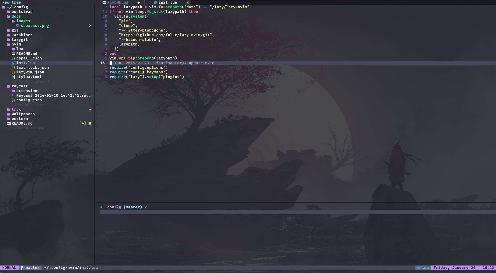

# My Amazing Dotfiles

## Install

1. Setup .config

```bash
rm -rf ~/.config && git clone https://github.com/tranthaison1231/dotfiles ~/.config/
```

2. Run bootstrap

```bash
cd ~/.config

./bootstrap/mac.sh <email-address> <username>
```

3. Add theme dracula for oh-my-zsh

- https://draculatheme.com/zsh

### Tools

- lazyvim
  - neo-tree
  - lazygit
  - git-conflict
  - git-signs
  - git-delta
  - nvim-surround
  - cspell
  - outline
  - telescope
  - mason
  - lsp
    ...
- wezterm
- raycast
- dracula theme

## Showcase



## Reference

- https://github.dev/LazyVim/LazyVim
- https://github.dev/NvChad/NvChad
- https://github.dev/jamestrew/nvim
- https://github.dev/dmmulroy/kickstart.nix 
- https://github.dev/AlejandroSuero/.config
- https://github.dev/a7lavinraj/dotfiles
- https://github.dev/badele/vide
- https://github.dev/ecosse3/nvim
- https://github.dev/mischavandenburg/dotfiles
- https://github.dev/louishuyng/dotfiles
- https://github.dev/immint023/dotfiles
- https://github.dev/chau-bao-long/dotfiles
- https://github.dev/theopn/dotfiles
- https://github.dev/pysan3/dotfiles
- https://github.dev/rebelot/dotfiles
- https://github.dev/jellydn/dotfiles
- https://github.dev/nartc/dotfiles
- https://github.dev/nicknisi/dotfiles
- https://github.dev/jdhao/dotfiles
- https://github.dev/GeekMasher/nvim
- https://github.dev/adibhanna/nvim
- https://github.dev/xixiaofinland/dotfiles/
- https://github.dev/planetsLightningArrester/run-commands
- https://github.dev/nvim-lua/kickstart.nvim
- https://github.dev/hungvx-dev/Dotfiles
